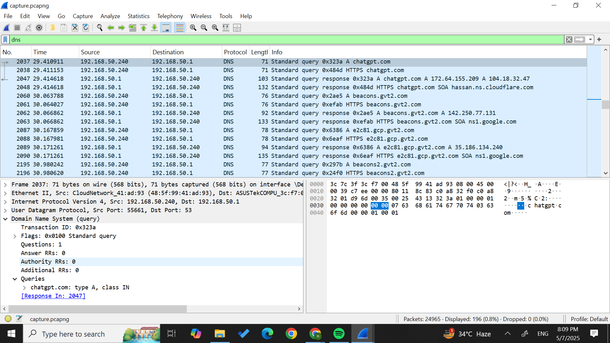
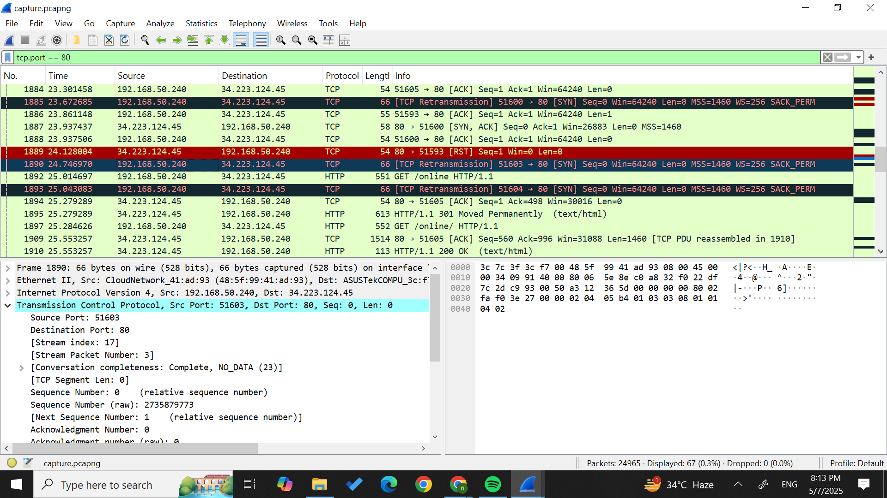
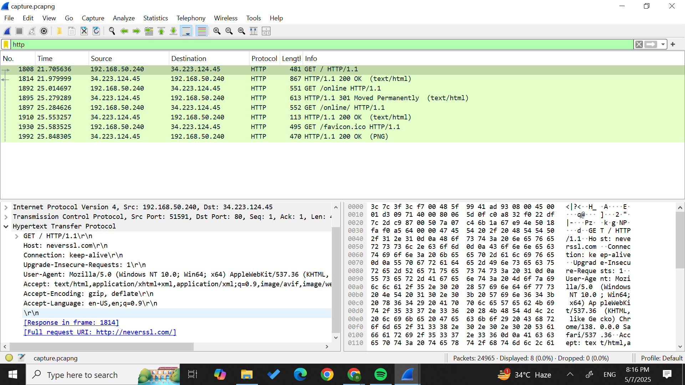

Analyzing TCP & DNS Traffic with Wireshark!!

This project uses Wireshark to capture and analyze real-world network traffic. I focused on identifying and understanding:

- A DNS query
- A TCP 3-way handshake
- An HTTP GET request

Tools Used

- Wireshark
- Chrome Browser
- Websites: neverssl.com, chatgpt.com, example.com
- `.pcap` file from live capture

---

Packet Highlights

1. DNS Query

Captured a DNS query for `chatgpt.com` using UDP on port 53.

---

2. TCP 3-Way Handshake

Observed SYN → SYN-ACK → ACK sequence to initiate a TCP connection with a web server.

---

HTTP GET Request

Captured a raw HTTP GET request to `neverssl.com` over TCP port 80.

---

WHAT I LEARNED!

- How DNS resolution works and where it fits in network flow
- What a TCP handshake looks like at the packet level
- How HTTP GET requests appear in plain-text over unencrypted connections
- How to filter and isolate specific protocol traffic in Wireshark

---

Credits

I made this as part of my self-learning in cybersecurity. Inspired by protocol deep-dives and beginner capture challenges. :)

# wireshark-tcp-analysis
Packet analysis project using Wireshark (DNS, TCP, HTTP)
dda81885d6e7668e5acbc2e6eb6a5715e611837f
